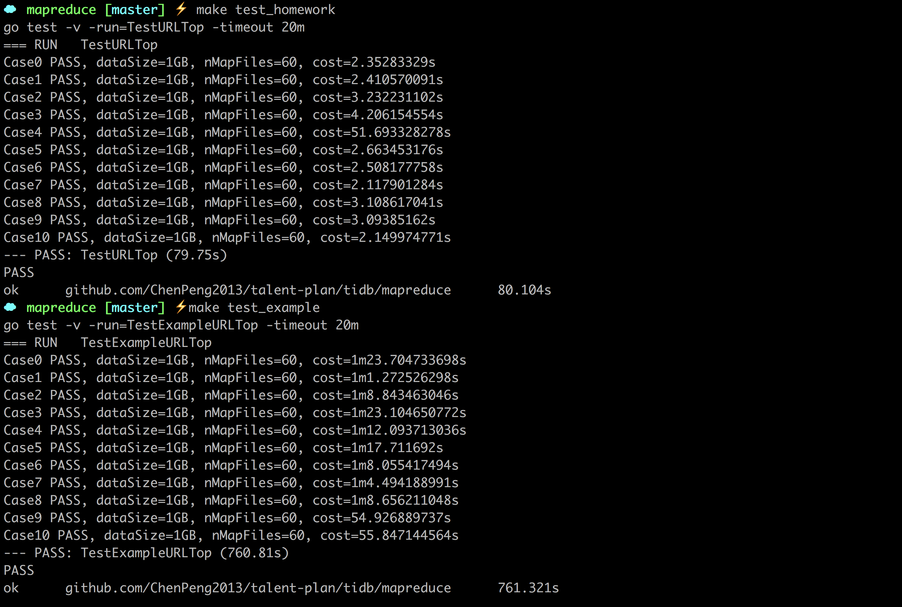

# mapreduce

## 框架

### run
在运行完所有的 map 后。创建 reduce task，等待运行完成，将最终的输出文件的 path，传给 channel notify.

### worker
如果是 reduce 的 worker，需要从所有的 map 的输出部分，获取自己分区的数据，并排序，将相同的 key，合并后，调用 reduceF，结果保存在文件中。

## top10

### 计数
优化的点，是在 map，从文件读取数据后，就直接计数，不是所有的都放到 reduce 里面计数。

这样做的好处有：
1. 减少 reduce 合并相同 key 的数据量。
2. 一个文件中重复 key 有大多数，能极大的减少磁盘 IO。

### 排序
根据 top10 的特性，在第一次 reduce 的时候，每个 reduce 输出只用保存前 10 个即可，并发处理，一定程度提高了运行效率。

## 性能对比
连续运行 make test_homework，make test_example 的结果对比如下。

homework 的运行时间，明显低于 example。