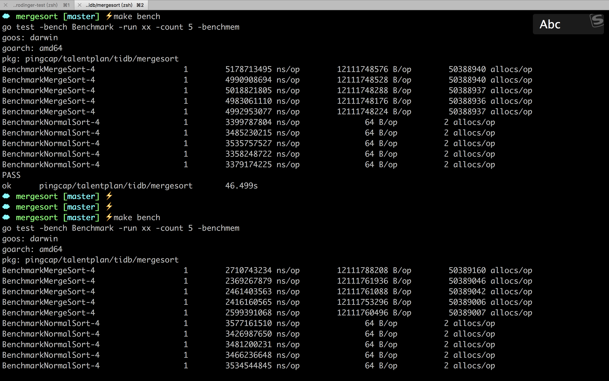

# mergesort

## 原理
归并排序排序的逻辑，是将两个有序的子数组，合并成一个数组。如果子数组不是有序的，则递归调用归并排序。

## 优化
在多个子数组排序时，他们的边界清晰，不重叠，互不影响，可以并发执行提高效率。

通过代码可以看出，数组大小超过 1000000，就启用多个协程并发排序。时间从 5s 左右下降到 2s 多，前后的性能对比如下。

1000000 是在选择性的测试下得到的结果，测试了 500000 2000000 等，在 16000000 数据规模下，太小的数组并发排序，并不会带来性能上的提升，大部分时间会在并发控制上。

